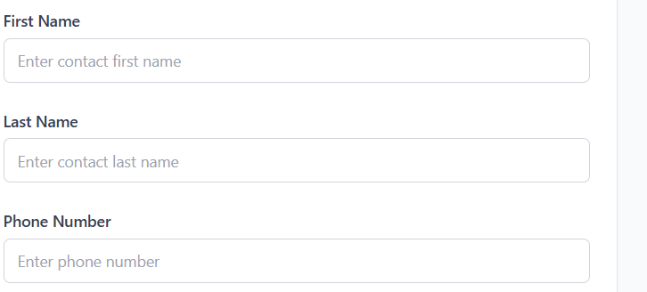
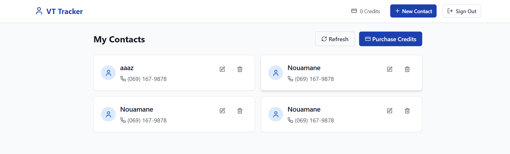
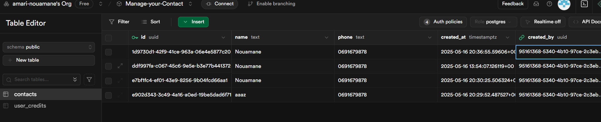
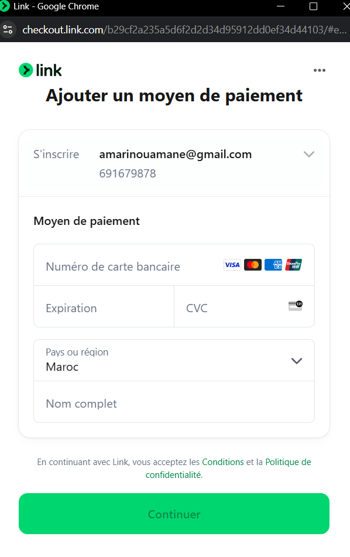
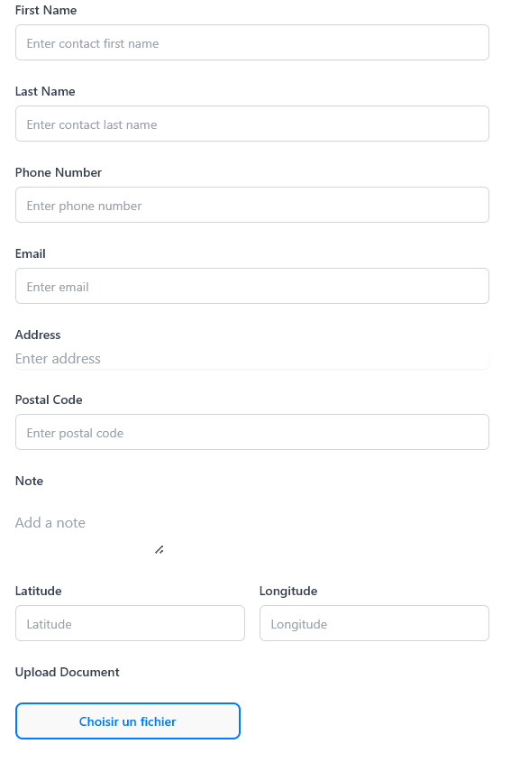

<strong>Bug corrigé :</strong> <em>"Failed to load contacts"</em>

- Créer un compte Supabase et configurer les clés d’accès dans un fichier `.env`.
- Créer la table `contacts` avec les colonnes nécessaires dans la base Supabase.
- Configurer les permissions pour autoriser l’accès aux données.
- Tester la connexion front-end / base de données pour valider le chargement des contacts.

<strong>Correction et amélioration des interfaces:</strong>

Dans le formulaire d’ajout de contact, séparer le champ "Name" en deux champs distincts : "First Name" et "Last Name".

Dans le header, remplacer le bouton "New Contact" par "Purchase Credits".

Lorsqu’un achat de crédits est effectué, enregistrer cette information dans la base de données.

  

<strong>Troisième mission : Ajout de fonctionnalités</strong>

<strong>Intégration de Stripe :</strong>  
Les paiements pour l’achat de crédits doivent passer par <a href="https://stripe.com/fr" target="_blank" style="color:#0c5460; text-decoration:underline;">Stripe</a>.

<strong>Champs à ajouter :</strong>
<ul style="margin: 8px 0 0 20px;">
  <li><strong>E-mail</strong></li>
  <li><strong>Adresse</strong></li>
  <li><strong>Code postal</strong></li>
  <li><strong>Note</strong></li>
  <li><strong>Téléversement de documents</strong></li>
</ul>

